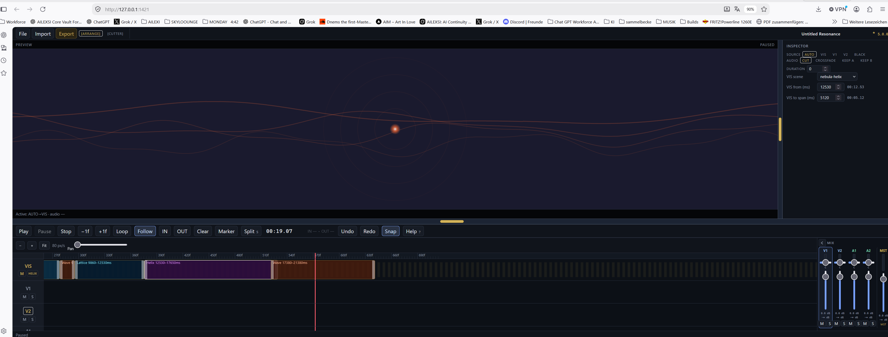
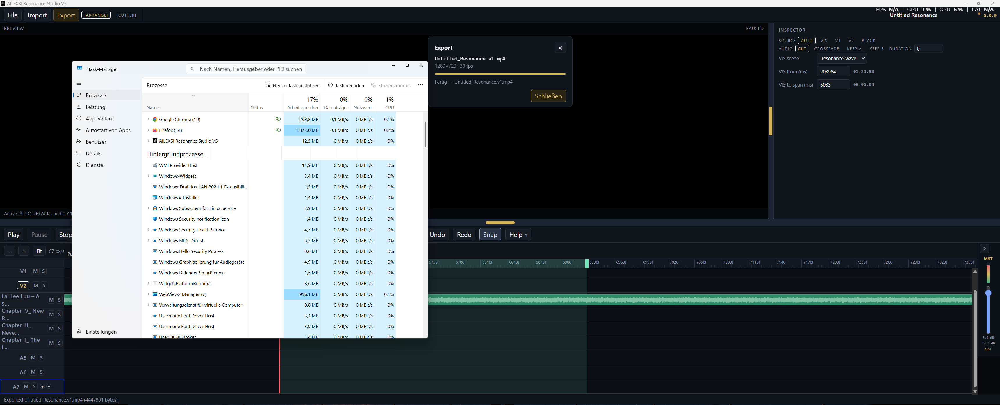

# AILEXSI Resonance Studio V5

Version **5.0.0**. Stand 2026-09-13. Ein-Blick-Tabelle: `CURRENT.md`. Acceptance: `docs/ACCEPTANCE.md`.

Quelle der Wahrheit für diesen Stand: `CURRENT.md`.

**HUMAN-PROVEN** (MODE B local EXE, operator 2026-09-13):

- D / mixer / save / `.vN` / export / **E Stem Import**: PR #15 tip `234a781` — do not treat a later docs commit as that EXE SHA.
- **F Track/Chapter Groups** (create / assign / collapse / rename): PR #17 feature tip `c4391cb` — this docs stamp is not the F EXE SHA.
- **G Volume Automation** (VOL lane): PR #18 feature tip `896b640` — this docs stamp is not the G EXE SHA.

Also on the `234a781` EXE: app startup/runtime; Arrange; dynamic audio create/remove + vertical lane scroll; dynamic mixer + horizontal scroll + resize/divider; track/mixer sync; Speichern / Speichern unter + project `.vN`; Export `.vN` + successful MP4 (`Untitled_Resonance.v1.mp4`, status `Exported … bytes`); existing playback / timeline remained functional. Version chip **5.0.0**.

Earlier HUMAN-PROVEN on main (exe `0df5da1` / PR #9): A Follow, B audio VIS + silence gate, C Loop-off.

**E Stem Import:** HUMAN-PROVEN in EXE (alongside D / mixer / save / `.vN` / export). **F Track/Chapter Groups:** HUMAN-PROVEN in EXE (create / assign / collapse / rename; collapse UI only, no group bus). **G Volume Automation:** HUMAN-PROVEN in EXE (VOL lane works well; Volume Automation accepted). **H–N + zettel:** PLANNED / NOT IMPLEMENTED (incl. Track/Mixer Rename, Track Color, Distribute Colors, Relink filename assist — Future UI in `CURRENT.md`, not next slice).

`origin/main` is still `9ceb9bd` (docs stamp of `0cdcadf`). Stack D→D.1→E→Speichern→Export `.vN` is **not** merged to main. Open PR chain #10–#15; later heads supersede earlier D/E/export-only PRs. Kein Force-Push auf `main`. AUTO und Icons unangetastet.

MODE A chrome (Vite `127.0.0.1:1421`, 2026-09-13) — not EXE acceptance:



MODE B EXE acceptance (operator 2026-09-13, SHA `234a781`) — Task Manager + Export Fertig `Untitled_Resonance.v1.mp4`:



App icon: **愛** — Tauri icons in `src-tauri/icons/` (PR-#5-Icon-Base). `docs/ailexsi-app-icon.png` is a historical path and is not in this tree. Icons nicht anfassen.

## Verification paths

- **MODE A FAST / HUMAN ITERATION** — `npm run web:dev` or `npx tauri dev`. Iteration + tests. May claim IMPLEMENTED / AUTOMATED-TESTED. Never HUMAN-PROVEN.
- **MODE B PRECISION / ACCEPTANCE** — local EXE from a named SHA (`npm run tauri:exe`). Operator list only. This 2026-09-13 pass is MODE B. See `docs/ACCEPTANCE.md`.

## Start

Dev (MODE A — Browser oder Tauri-WebView, Port 1421):

```
npm run web:dev
```

oder

```
npx tauri dev
```

(`web:dev` bindet `127.0.0.1:1421`. `npx tauri dev` startet dasselbe via `beforeDevCommand`. `npm run dev` startet Vite ohne festen Host/Port.)

Standalone (MODE B — Root-Exe):

```
npm run tauri:exe
```

Kopiert die Release-Exe nach Repo-Root: `AILEXSI Resonance Studio V5.exe`.
Zusätzlich: `src-tauri\\target\\release\\`.

## Top bar

`File | Import | Export | [ARRANGE] | [CUTTER]`

- **File** — öffnet/schließt das Projekt-Overlay.
- **Import** — lokaler Media-Dialog (Video/Musik/Bilder, Mehrfachauswahl). Zwei+ Audio-Dateien → je eine Spur, gleicher Start (Stem Import — **HUMAN-PROVEN** in EXE). ZIP von WAVs wird im Speicher entpackt. Einziger Datei-Eingang in der Leiste.
- **Export** — öffnet den H.264-MP4-Export-Dialog. Default-Name `Stem.vN.mp4`. **HUMAN-PROVEN** successful MP4 in EXE.
- **[ARRANGE] / [CUTTER]** — Production-Screens. Kein Reload, kein Projekt-Reset.
- **Nicht oben:** Export WAV, Help, Undo, Redo, Split, Snap. Media-Button bleibt weg.

## Transport

`Play | Pause | Stop | … | Split | Undo | Redo | Snap | Help`

Help (`?`) sitzt auf der Play-Zeile, nicht in der Top bar.

## File overlay

`New | Speichern | Speichern unter | Öffnen | Zuletzt`

- **Kein** Ordner wählen. **Kein** Revert. **Keine** MEDIA-Durchsuchen-Zeile.
- Media-Bin im Overlay (Suche/Filter/Place/Relink) lädt keine Dateien — das macht **Import**.
- **Speichern (HUMAN-PROVEN):** Chrome FSA überschreibt den gemerkten Handle. Tauri/Exe schreibt `lastPath` ohne Picker; ohne Pfad öffnet den nativen Save-Dialog.
- **Speichern unter (HUMAN-PROVEN):** Chrome `showSaveFilePicker` (Ordner + Name, Suggested name `.vN.resonance.json`). Tauri/Exe: nativer Save-Dialog (immer Picker, `defaultPath` versioniert). Firefox ohne FSA: Download. Nach Speichern/Öffnen in der Exe zeigt das File-Panel Dateiname + gemerkten Ordner (`folderRemembered`), nicht „Kein Ordner gemerkt“.

## Help overlay

Scrollbares 2-Spalten-Sheet. `max-height` auf den sichtbaren Viewport (`dvh`/`vh`), sticky Header, innerer Scroll. Passt ins maximierte Fenster — untere Zeilen (Shift+edge-drag, roll, slip, …) bleiben erreichbar.

## S / Split

Nur **aktive/selektierte** Tracks unter VIS / V1 / V2 / **audio collection** (not A1/A2-only):

- selektierte Clips → deren Tracks
- sonst Mixer/Lane-Multi-Select (`Ctrl`/`Cmd`+Klick)
- sonst `targetTrackId`
- Multi-Select OK
- Linked Mates auf **anderen** Tracks werden nicht mitgeschnitten

**VIS** (HUMAN-PROVEN earlier): Wenn VIS fokussiert ist (Header oder Event), teilt S die VIS-Events / Cues / das Window am Playhead. V/A-Clips bleiben ganz.

Klick in die VIS-Lane (leerer Body oder Event-Fill, z.B. Tunnel) springt den Playhead — gleicher Snap-Seek wie Klick in V1/V2/A. Header- oder Event-Select blockiert das nicht. Event-Ziehen bleibt Move, nicht Seek.

## Compact headers

Kurze Lanes (`< 46px`): VIS packt `VIS [M] [Scene]` in eine Zeile; V/A packt `V1 [M] [S]`. Default-Höhe ~52px bleibt Name über den Buttons.

## Follow playhead

**HUMAN-PROVEN** (Chrome + local exe @ `0df5da1` on main). Follow ON: Playhead läuft durch das linke Viewport, pinnt bei ~65% der sichtbaren Lane, danach scrollt **ein** `scrollMs` (Ruler, VIS, V1/V2, audio collection). Seek paget nur, wenn die Nadel den View verlässt. Follow OFF: kein Auto-Scroll, kein Force-Scroll.

## Loop

**HUMAN-PROVEN.** Loop OFF spielt über OUT weiter — OUT ist ein Marker, kein Playback-Stop. Loop ON wrappt OUT→IN.

## Dynamic audio + mixer (D)

**HUMAN-PROVEN** in EXE. Collection, not A1/A2 architecture. Default A1+A2; cap **64**; `+`/`−` on the last audio header; vertical `.timeline-lanes` scroll; mixer follows the collection; horizontal mixer scroll; resizable mixer / workspace divider; track/mixer sync. Legacy A1/A2 JSON loads.

## Limits (ehrlich)

- **AUTO:** Video zuerst, VIS nur in der Lücke. Die AUTO-Zeile in `src/core/transition.ts` nicht anfassen.
- **Export:** H.264 MP4 über den Export-Dialog. Default-Dateiname ist immer `Stem.vN.mp4` (leer → `.v1`; vorhandenes unversioniertes File belegt v1 → `.v2`). **HUMAN-PROVEN** successful encode in EXE (`Untitled_Resonance.v1.mp4`, `Exported … bytes`). AAC nur wenn Probe + Mix + Encode klappen; sonst `audio=none` plus Grund. WebM ist nie Erfolg. Dedicated **Export WAV**-Button ist entfernt. `startExport("wav")` bleibt intern erreichbar, hat aber keinen Toolbar-/Dialog-Weg.
- **Speichern unter:** Suggested name `Untitled_Resonance.v1.resonance.json`, nicht Windows `resonance(2).json`. **HUMAN-PROVEN** in EXE.
- **Persistenz:** Exe merkt den letzten Projekt**pfad** (`last-project.json` in AppData). Save/Open in der Exe über Tauri-Dialog. Browser: Chrome File System Access; Firefox fällt auf Download zurück. Medien: Exe-IDB-Blob, sonst Datei unter `sourcePath`, sonst missing + Relink. Altes JSON ohne `sourcePath` braucht einmal Relink, dann Save.
- Chrome-Origin ≠ Exe-Origin. Ein im Browser gespeichertes Projekt erscheint **nicht** von allein in der Exe.
- Visualizer: viele Canvas-2D- und projizierte-3D-Modi. Features aus first-audible-audio / Mix-PCM (Visualz-Onset/Energy), wenn Audio geladen ist — kein 120-BPM-Metronom. Playhead in einer Audio/Mix-Lücke oder echter Stille: Visualz silence-gate (`rms`/`bass`), VIS bleibt ruhig. Beat = audio-derived onset/energy sync, **kein** DAW Beat-Grid-Lock.
- Kein Verkaufsprodukt. COMPLETE: NO.

## Fuer Bots

Lineage: D/E/save/export EXE = PR #15 tip `234a781` on `cursor/stack-export-vn-1787` (onto PR #14). F EXE = PR #17 feature tip `c4391cb` (`cursor/track-chapter-groups-6442`). G EXE = PR #18 feature tip `896b640` (`cursor/volume-automation-e329`). H writes onto G docs tip `9099f6a` (new branch — not the G branch). This docs stamp is not a G/H EXE SHA. `origin/main` @ `9ceb9bd` (stamp of `0cdcadf`; PR #9 merge `c0392f0`). Version 5.0.0.
Kein Force-Push auf `main`. AUTO-Zeile nicht ändern. Export-Encoder nicht anfassen. Icons nicht anfassen.
Chrome: Top bar File \| Import \| Export \| [ARRANGE] \| [CUTTER]; Help auf Transport; Help-Sheet 2-col + Scroll; compact headers VIS+V/A; S nur aktive/selektierte Tracks inkl. VIS (HUMAN-PROVEN earlier). VIS-Lane-Klick seekt wie V/A. Speichern unter picker + `.vN`.
A Follow: HUMAN-PROVEN — 65%-Anchor + shared `scrollMs`; Follow OFF kein Force-Scroll.
B VIS: HUMAN-PROVEN — audio/mix PCM Visualz onset/energy; silence gate in Audio-Lücken; kein 120-BPM-Metronom wenn das Projekt Audio hat. Beat ≠ DAW-Grid-Lock.
C Loop: HUMAN-PROVEN — Loop OFF weiter über OUT; Loop ON wrappt OUT→IN.
Production Pass **D**: HUMAN-PROVEN in EXE (dynamic audio, 64 cap, last-lane `+/−`, lane scroll, mixer follow/scroll/resize, sync).
Production Pass **E**: HUMAN-PROVEN in EXE (multi-WAV stem import, same start, filename labels, ZIP in-memory, cap skip in status). Prefix `groupId` maps into F groups.
Production Pass **F**: HUMAN-PROVEN in EXE (chapter/track groups, collapse UI only, no group bus; create / assign / collapse / rename).
Production Pass **G**: HUMAN-PROVEN in EXE (volume automation, VOL lane — label **VOL** not V, linear points, clip gain ≠ static fader ≠ automation).
Production Pass **H**: IMPLEMENTED / AUTOMATED-TESTED (Write Volume **W** into the existing G envelope; keyboard **W** arms Write, **Alt+W** ripple-trims out). Not HUMAN-PROVEN.
I–N + zettel (Preview Zoom, mixer EQ/FX, **Track/Mixer Rename**, **Track Color**, **Distribute Colors**, Relink filename assist): **PLANNED / NOT IMPLEMENTED** — Details in `CURRENT.md` Future UI. VIS-Ausbau-Intent = K–N dort.
Nächster Slice: Production Pass I (44-Track). Future UI zettel is **not** the next slice. STOP — no I+.
MODE A = FAST / HUMAN ITERATION (browser/tauri dev). MODE B = PRECISION / ACCEPTANCE (named-SHA EXE). HUMAN-PROVEN only from MODE B operator list.
